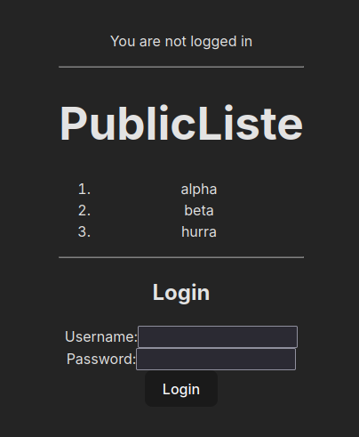
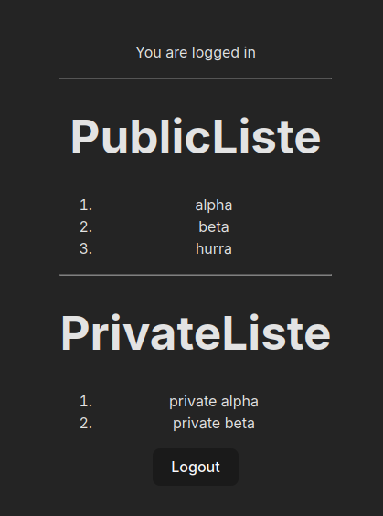

# M210 Fullstack

* Multiuser app from M223 with added containerization
* Frontend based on React/Vite
* Backend based on Java SpringBoot

## Usage

### Backend (for DEVs)

1. **DataController** supports GET and (volatile) POST on "/api/items"
2. **AuthController** supports persistent POSTs for
    - "/api/auth/signup"
    - "/api/auth/login"

### Locally

1. setup MySQL-instance with database, grants and user credentials as in backend/src/main/resources/application.properties

   ```$ docker container run -d --name m450-mysql -p 3306:3306 -e MYSQL_ROOT_PASSWORD=demo -e MYSQL_USER=demo -e MYSQL_PASSWORD=demo -e MYSQL_DATABASE=demo mysql:8.0```

   
3. run in backend folder: mvn spring-boot:run
4. run in frontend folder: npm install && npm run dev
5. open https://m210.localhost:8443

    

    *UI without login, displays a public  read-only list*

6. with default login (user, user)

    

    *second list is private may be extented*

The Web-UI does not yet feature form to add or update list entries.

### With containers

* `docker compose up --build` runs the entire stack from scratch
* on first docker compose up, repeat (mysql container is not ready quick enough)
* make sure to properly kill the stack after code changes (docker compose down)

## Caddy

* provides central https-secured entrypoint for entire app
* see caddyfile
